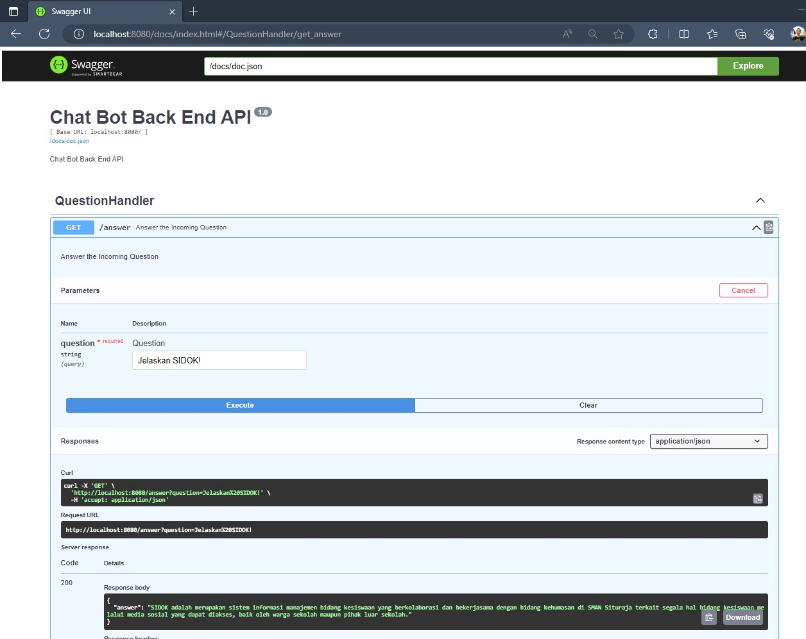

# Indonesian Sentence-BERT Retrieval-Based Q&A Chatbot (Go & React)

### Screenshot

Answer the User Question



<br/>

### How to Install

1. Install Golang 1.25 (https://go.dev/doc/install)
2. Clone this Repository
3. Check the .env, that file must be present (example: env.example)
4. Instalation

```bash
set GOOS=windows 
set GOARCH=amd64 
set CGO_ENABLED=1

go mod tidy
```

5. Run the App 

```bash
go run main.go
```

Notes:

If change the application routes and handler, install swagger and please update the docs

```bash
# Install Swagger Gen
go install github.com/swaggo/swag/cmd/swag@0.1.12

# Update Swagger Docs from Code
swag init
```
